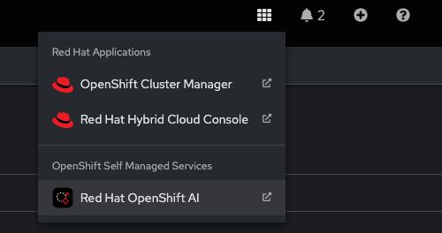

# Quick Start Guide for Distributed Workloads with the CodeFlare Stack

<!--toc:start-->
- [Quick Start Guide for Distributed Workloads with the CodeFlare Stack](#quick-start-guide-for-distributed-workloads-with-the-codeflare-stack)
  - [Prerequisites](#prerequisites)
    - [Resources](#resources)
    - [GPU Worker Node](#gpu-worker-node)
  - [Automatic deployment for developers (optional - skip to run steps manually)](#automatic-deployment-for-developers-optional-skip-to-run-steps-manually)
    - [Next Steps After Automatic Deployment](#next-steps-after-automatic-deployment)
  - [Red Hat OpenShift AI](#red-hat-openshift-ai)
    - [Configure Data Science Components](#configure-data-science-components)
  - [Preparing Your Cluster for GPU Workloads](#preparing-your-cluster-for-gpu-workloads)
    - [Installing the Operators](#installing-the-operators)
    - [Configure the Node Feature Discovery Operator](#configure-the-node-feature-discovery-operator)
    - [Configure the NVIDIA GPU Operator](#configure-the-nvidia-gpu-operator)
  - [Configure Kueue for Task Scheduling](#configure-kueue-for-task-scheduling)
  - [Launch a Jupyter Notebook Instance](#launch-a-jupyter-notebook-instance)
  - [Submit your first job](#submit-your-first-job)
    - [Clone the demo code](#clone-the-demo-code)
    - [Run the Guided Demo Notebooks](#run-the-guided-demo-notebooks)
  - [Cleaning up the AI Platform Install](#cleaning-up-the-ai-platform-install)
    - [Manual Cleanup Steps](#manual-cleanup-steps)
  - [Next Steps](#next-steps)
<!--toc:end-->

This quick start guide is intended to walk users through installation of the CodeFlare stack and an initial demo using the CodeFlare-SDK from within a Jupyter notebook environment. This will enable users to run and submit distributed workloads.

The CodeFlare-SDK was built to make managing distributed compute infrastructure in the cloud easy and intuitive for Data Scientists. However, that means there
needs to be some cloud infrastructure on the backend for users to get the benefit of using the SDK. Currently, we support the CodeFlare stack.

This stack integrates well with Red Hat OpenShift AI and [Open Data Hub](https://opendatahub.io/), and helps to bring batch workloads, jobs, and queuing to the Data Science platform. Although this document will guide you through setting up with Red Hat OpenShift AI (RHOAI), the steps are also applicable if you are using Open Data Hub (ODH). Both platforms are available in the OperatorHub, and the installation and configuration steps are quite similar. This guide will proceed with RHOAI, but feel free to apply the instructions to ODH as needed.

## Prerequisites

### Resources

In addition to the resources required by default Red Hat OpenShift AI deployments, you will need the following to deploy the Distributed Workloads stack infrastructure pods:

```text
Total:
    CPU: 1600m (1.6 vCPU)
    Memory: 2048Mi (2 GiB)
```

> [!NOTE]
> The above resources are just for the infrastructure pods. To be able to run actual
> workloads on your cluster you will need additional resources based on the size
> and type of workload.

### GPU Worker Node

> [!IMPORTANT]
> This step is necessary only if you require GPU capabilities for your workloads and your OpenShift cluster does not already include GPU-equipped nodes, follow these steps:

1. **Open the OpenShift Cluster Console.**
2. Navigate to **your-cluster** -> **Machine pools**.
3. Click on **“Add machine pool”**.
4. Provide a **name** for the new machine pool.
5. In the **“Compute node instance type”** dropdown, scroll all the way down and search for the GPU instance type `g4dn.xlarge` or similar.
6. Click on **Add machine pool** to finalize the creation of your new GPU-enabled machine pool.

After adding the machine pool, OpenShift will begin provisioning the new GPU worker
node. This process can take a few minutes. Once completed, the new node will be ready to handle GPU-accelerated workloads.

> [!NOTE]
> The `g4dn.xlarge` instance type is used for GPU worker nodes. Ensure this instance type meets your application needs or select another as required.

## Automatic deployment for developers (optional - skip to run steps manually)

As a quick alternative to the following manual deployment steps an automatic _Makefile_ script can be used to deploy the CodeFlare stack. This script also deploys the prerequisite operators and the entire CodeFlare stack.

1. Clone the Repository

```bash
git clone https://github.com/project-codeflare/codeflare-operator.git
cd codeflare-operator
```

2. Run the Makefile script

```bash
make all-in-one
```

> [!TIP]
> Execute `make help` to list additional available operations.

### Next Steps After Automatic Deployment

After the automatic deployment is complete, you can proceed directly to the section [Configure Kueue for Task Scheduling](#configure-kueue-for-task-scheduling) to finish setting up your environment.

## Red Hat OpenShift AI

This Quick Start guide assumes that you have administrator access to an OpenShift cluster and an existing Red Hat OpenShift AI (RHOAI) installation with version **>2.9** is present on your cluster. But the quick step to install RHOAI is as follows:

1. Using the OpenShift web console, navigate to **Operators** -> **OperatorHub**.
2. Search for `Red Hat OpenShift AI`.
3. Install it using the `fast` channel.

### Configure Data Science Components

After the installation of the Red Hat OpenShift AI Operator, proceed to configure the necessary components for data science work:

1. From the OpenShift web console, navigate to the installed RHOAI Operator.
2. Look for tab labeled DSC Initialization.
3. If it has not already been created - Locate `Create DSCInitialization` and create one.
4. Look for tab labeled Data Science Cluster.
5. Locate `Create DataScienceCluster` and create one.

## Preparing Your Cluster for GPU Workloads

To leverage GPU-enabled workloads on your OpenShift cluster, you need to install both the Node Feature Discovery (NFD) Operator and the NVIDIA GPU Operator.

### Installing the Operators

Both the NFD and the NVIDIA GPU Operators can be installed from the OperatorHub.
Detailed steps for installation and configuration are provided in the NVIDIA
documentation, which can be accessed [here](https://docs.nvidia.com/datacenter/cloud-native/gpu-operator/openshift/steps-overview.html#high-level-steps).

1. **Open the OpenShift dashboard.**
2. Navigate to **OperatorHub**.
3. Search for and install the following operators (default settings are fine):
   - **Node Feature Discovery Operator**
   - **NVIDIA GPU Operator**

### Configure the Node Feature Discovery Operator

After installing the Node Feature Discovery Operator, you need to create a Node Feature Discovery Custom Resource (CR). You can use the default settings for this CR:

1. Create the Node Feature Discovery CR in the dashboard.
2. Several pods will start in the `openshift-nfd` namespace (which is the default).
   Wait for all these pods to become operational. Once active, your nodes will be
   labeled with numerous feature flags, indicating that the operator is functioning
   correctly.

### Configure the NVIDIA GPU Operator

After installing the NVIDIA GPU Operator, proceed with creating a GPU ClusterPolicy Custom Resource (CR):

1. Create the GPU ClusterPolicy CR through the dashboard.
2. This action will trigger several pods to start in the NVIDIA GPU namespace.

> [!NOTE]
> These pods may take some time to become operational as they compile the necessary drivers.

## Configure Kueue for Task Scheduling

Kueue is used for managing and scheduling task workflows in your cluster. To configure Kueue in your environment, follow the detailed steps provided

1. Install Kueue resources, namely Cluster Queue, Resource Flavor, and Local Queue:
   - Visit [Kueue Resources configuration](https://github.com/project-codeflare/codeflare-sdk/blob/main/docs/setup-kueue.md)

## Launch a Jupyter Notebook Instance

After setting up the Data Science Cluster components, you can start using the Jupyter notebooks for your data science projects. Here’s how to launch a Jupyter notebook:

1. Access the RHOAI Dashboard:
   -  
   - Navigate to the Red Hat OpenShift AI dashboard within your OpenShift web console.
2. Create a Data Science Project:
   - Go to the Data Science Projects section from the dashboard menu.
   - Click on `Create data science project` and follow the prompts to set up a new project.
3. Launch Jupyter Workbench:
   - Inside your newly created project, find and click on the "Create Workbench" button.
   - On the Workbench creation page, select "Standard Data Science" from the list of available notebook images. This image will include common data science libraries and tools that you might need.
   - Configure any additional settings such as compute resources or environment variables as needed and `Create workbench`
4. Access Your Notebook:
   - Once the workbench is ready, click on the provided link or button to open your Jupyter notebook.
## Submit your first job

We can now go ahead and submit our first distributed model training job to our cluster.

This can be done from any python based environment, including a script or a jupyter notebook. For this guide, we'll assume you've selected the "Jupyter Data Science" from the list of available images on your notebook spawner page.

### Clone the demo code

Once your notebook environment is ready, in order to test our CodeFlare stack we will want to run through some of the demo notebooks provided by the CodeFlare community. So let's start by cloning their repo into our working environment.

```bash
git clone https://github.com/project-codeflare/codeflare-sdk
cd codeflare-sdk
```

For further development guidelines and instructions on setting up your development environment for codeflare-sdk, please refer to the [CodeFlare SDK README](https://github.com/project-codeflare/codeflare-sdk?tab=readme-ov-file#development).

### Run the Guided Demo Notebooks

Get started with the guided demo notebooks for the CodeFlare-SDK by following these steps:

1. Access Your Jupyter Notebook Server:
2. Update Your Notebook with Access Token and Server Details:
   - Retrieve your OpenShift access token by selecting your username in the console, choosing "Copy Login Command", and then "Display Token".
   - Open your desired demo notebook from the `codeflare-sdk/demo-notebooks/guided-demos` directory.
   - Update the notebook with your access token and server details and run the demos.

## Cleaning up the AI Platform Install

To completely clean up all the components after an install, follow these steps:

```bash
make delete-all-in-one
```
### Manual Cleanup Steps

If you prefer to manually clean up the installation or need to manually remove individual components and operators, follow these steps:

1. Uninstall Operators
   - Open the OpenShift dashboard.
   - Go to Installed Operators.
   - Look for any operators you have installed, such as the NVIDIA GPU Operator, Node Feature Discovery Operator, and Red Hat OpenShift AI Operator.
   - Click on the operator and then click Uninstall Operator. Follow the prompts to remove the operator and its associated resources.

## Next Steps

And with that you have gotten started using the CodeFlare stack alongside your Red Hat OpenShift AI Deployment to add distributed workloads and batch computing to your machine learning platform.

You are now ready to try out the stack with your own machine learning workloads. If you'd like some more examples, you can also run through the existing demo code provided by the Codeflare-SDK community.

- [Submit basic job](https://github.com/project-codeflare/codeflare-sdk/blob/main/demo-notebooks/guided-demos/1_cluster_job_client.ipynb)
- [Run an interactive session](https://github.com/project-codeflare/codeflare-sdk/blob/main/demo-notebooks/guided-demos/2_basic_interactive.ipynb)
